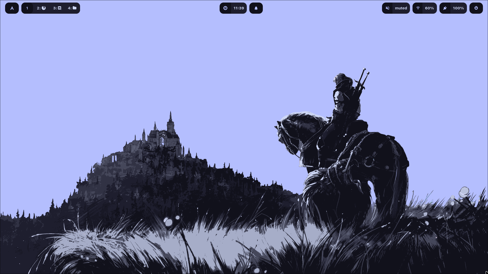
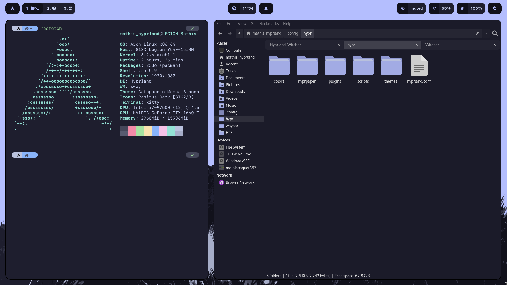
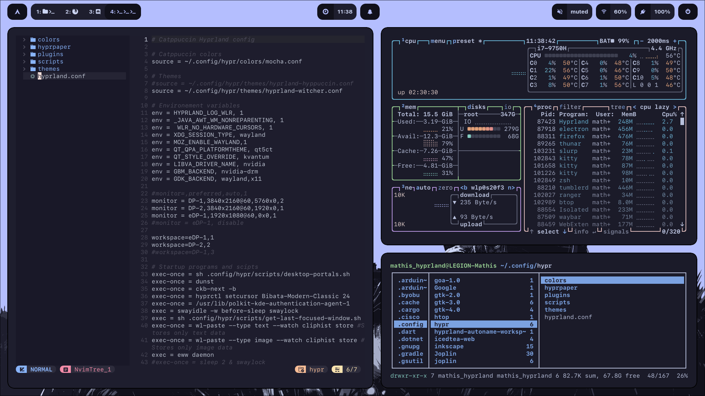
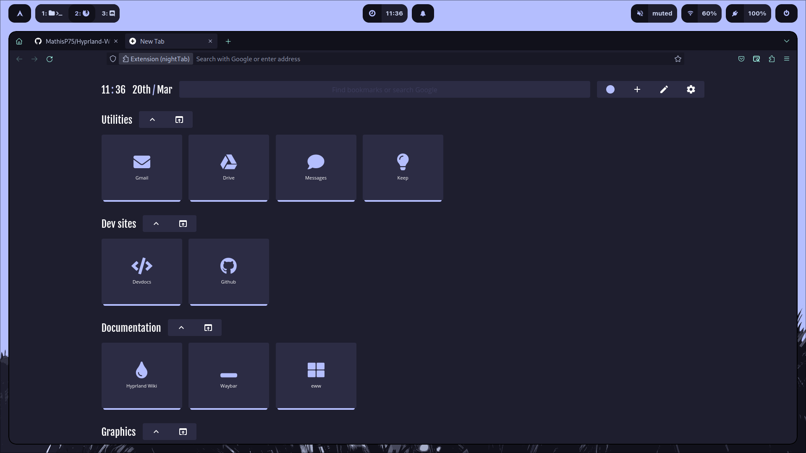
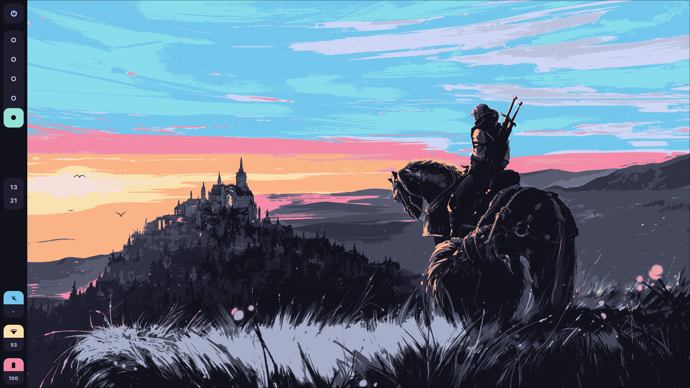

# Hyprland-Witcher
Catppuccin Witcher theme for Hyprland

* Compositor: Hyprland
* Terminal: Kitty
* Shell: zsh
* Color scheme (and all themes): Cattpuccin with lavender accent color
* GUI file manager: Thunar
* TUI file manager: Ranger
* Bar: Waybar
* App launcher: Wofi
* Text editor: nvim
* Cursor theme: Bibata modern classic
* PDF viewer: Zathura

***

***

***

***

